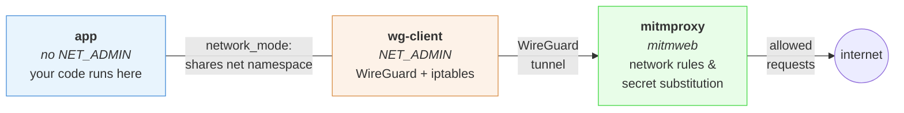
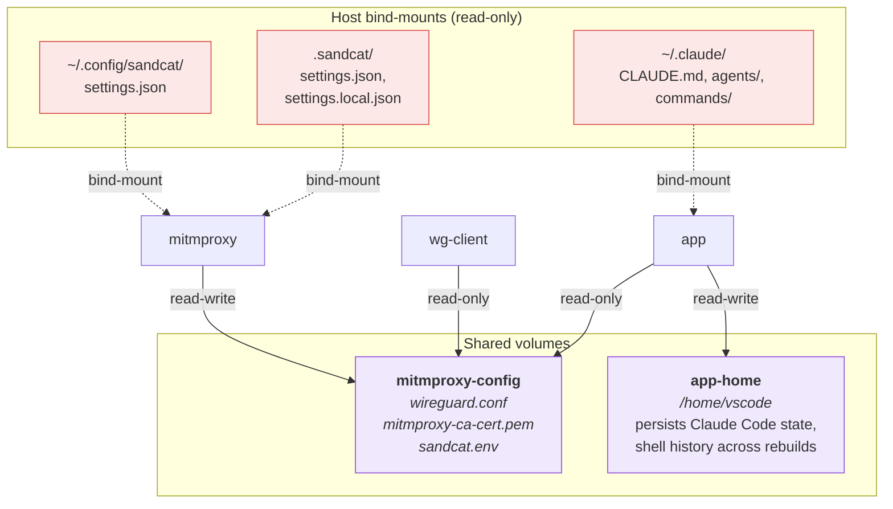
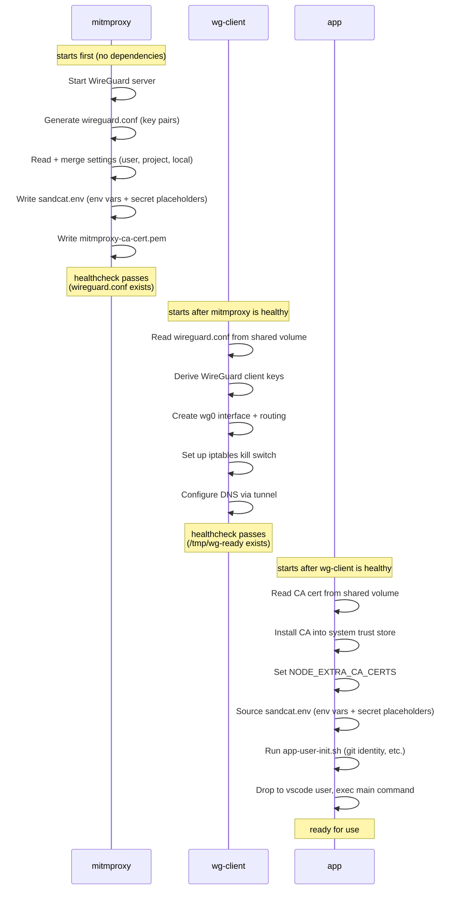

# Sandcat

Sandcat is a Docker & [dev container](https://containers.dev) setup for securely
running AI agents. The environment is sandboxed, with controlled network access
and transparent secret substitution. All of this is done while retaining the
convenience of working in an IDE like VS Code.

All container traffic is routed through a transparent
[mitmproxy](https://mitmproxy.org/) via WireGuard, capturing HTTP/S, DNS, and
all other TCP/UDP traffic without per-tool proxy configuration. A
straightforward allow/deny list-based engine controls which network requests go
through, and a secret substitution system injects credentials at the proxy level
so the container never sees real values.

This repository contains:

* a bash CLI to initialize the sandbox for a project, copying and customizing
  the necessary files
* reusable proxy definitions: `Dockerfile.wg-client`, `compose-proxy.yml`, and
  `scripts` that perform the network filtering & secret substitution
* template application and dev container configuration: `Dockerfile.app`,
  `compose-all.yml`, `devcontainer.json`. This should be fine-tuned for each
  project and specific development stack, to install required tools and
  dependencies.

Sandcat can be used as a devcontainer setup, or standalone, providing a shell
for secure development.

## Quick start

### 1. Install sandcat CLI

The [CLI](cli/README.md) is a helper script and thin wrapper around
docker-compose that simplifies the process of initializing and starting the
sandbox.

It has two main tasks:
* copy the necessary configuration files from the `cli/templates` directory into
  your project and customize them based on your choices (development stack,
  etc.)
* run `docker compose` commands with the correct compose file automatically
  detected, so you don't have to remember the file names or paths.

The CLI can itself be run through a docker image that we publish to our
repository, so that no local installation is required; or installed locally by
cloning this git repository.

#### Run as docker image (recommended)

```bash
# Pull the image to local docker
docker pull ghcr.io/virtuslab/sandcat

# Add to your .bashrc or .zshrc
alias sandcat='docker run --rm -it -v "/var/run/docker.sock:/var/run/docker.sock" -v"$PWD:$PWD" -v"$HOME/.config/sandcat:$HOME/.config/sandcat" -w"$PWD" -e TERM -e HOME ghcr.io/virtuslab/sandcat'
```

The CLI needs access to your current directory (to copy project configuration),
the host Docker socket (to manage sandbox containers), your user config
directory (`~/.config/sandcat/` to initialize the settings file), and a couple
of environment variables (`TERM` for terminal handling, `HOME` so Docker Compose
can resolve `~` in volume mounts).

Using the Docker image disables the editor integration (`vi` installed in the
image will be used instead of your host editor). Host environment variables are
not forwarded unless you add `-e` flags explicitly.

The image runs as root, to avoid permission issues with the host Docker socket.
On Colima file ownership is mapped automatically, on Linux you should add
`--user` parameter accordingly.

#### Local install

```bash
# Clone the repo
git clone https://github.com/VirtusLab/sandcat.git

# Add the sandcat bin directory to your path (add this to your .bashrc or .zshrc)
export PATH="$PWD/sandcat/cli/bin:$PATH"
```

`yq` is required to edit compose files.

### 2. Initialize the sandbox for your project

```bash
sandcat init
```

This prompts you to select the agent type, IDE (for devcontainer mode), and
development stacks to install. You can also pass flags to skip prompts:

```bash
sandcat init --agent claude --ide vscode --stacks "python,node"
```

Available stacks: `node`, `python`, `java`, `rust`, `go`, `scala`, `ruby`,
`dotnet`. Versions default to LTS where available (e.g. Node.js LTS, Java LTS).
To change versions after init, edit the `mise use` lines in
`.devcontainer/Dockerfile.app`.

Selecting `scala` automatically includes `java` as a dependency. Stacks also
install the corresponding VS Code extension (e.g. `rust-analyzer` for Rust,
`metals` for Scala).

Optional volume mounts (Claude config, shell customizations, dotfiles, .git,
.idea) are included as commented-out entries in the generated compose file.
Uncomment them as needed, or set `SANDCAT_*` environment variables for scripted
usage. See the [CLI README](cli/README.md) for the full list of flags and
environment variables.

### 3. Start the sandbox

**CLI mode:**

```bash
# Open a shell in the agent container
sandcat run

# Start your agent cli (e.g. claude). Because you're in a sandbox, you can use yolo mode!
claude-yolo
```

### Customizing the generated files

**`compose-all.yml`** — `network_mode: "service:wg-client"` routes all traffic
through the WireGuard tunnel. The `mitmproxy-config` volume gives your container
access to the CA cert, env vars, and secret placeholders. The `~/.claude/*`
bind-mounts forward host Claude Code customizations — remove any mount whose
source does not exist on your host.

**`Dockerfile.app`** — uses [mise](https://mise.jdx.dev/) to manage language
toolchains. Stacks selected during `sandcat init` are added as `RUN mise use -g`
lines. You can edit the versions or add more stacks after init. Some runtimes
need extra configuration to trust the mitmproxy CA — see [TLS and CA
certificates](#tls-and-ca-certificates).

**`devcontainer.json`** — includes VS Code hardening settings (credential socket
cleanup, workspace trust, disabled local terminal). See [Hardening the VS Code
setup](#hardening-the-vs-code-setup) for details.

## Settings format

Settings are loaded from up to three files (highest to lowest precedence):

| File | Scope | Git |
|------|-------|-----|
| `.sandcat/settings.local.json` | Per-project overrides | **Ignored** (add to `.gitignore`) |
| `.sandcat/settings.json` | Per-project defaults | Committed |
| `~/.config/sandcat/settings.json` | User-wide defaults | N/A |

All three files use the same JSON format. Missing files are silently skipped. If
no files exist, the addon disables itself.

**Merge rules:**
- `env` — merged; higher-precedence values overwrite lower ones.
- `secrets` — merged; higher-precedence entries overwrite lower ones.
- `network` — concatenated; highest-precedence rules come first. Since rules are
  evaluated top-to-bottom with first-match-wins, this means local rules take
  priority over project rules, which take priority over user rules.

A typical setup keeps user-specific settings (git identity, API keys) in the
user file, project-wide network rules in the project file, and developer
overrides in the local file:

`~/.config/sandcat/settings.json` (user — created by `sandcat init` on first
run):

```json
{
  "env": {
    "GIT_USER_NAME": "Your Name",
    "GIT_USER_EMAIL": "you@example.com"
  },
  "secrets": {
    "ANTHROPIC_API_KEY": {
      "value": "sk-ant-real-key-here",
      "hosts": ["api.anthropic.com"]
    },
    "GITHUB_TOKEN": {
      "value": "ghp_your-token-here",
      "hosts": ["github.com", "*.github.com", "*.githubusercontent.com"]
    }
  },
  "network": [
    {"action": "allow", "host": "*.github.com"},
    {"action": "allow", "host": "github.com"},
    {"action": "allow", "host": "*.githubusercontent.com"},
    {"action": "allow", "host": "*.anthropic.com"},
    {"action": "allow", "host": "*.claude.ai"},
    {"action": "allow", "host": "*.claude.com"}
  ]
}
```

`.sandcat/settings.json` (project, committed):

```json
{
  "network": [
    {"action": "allow", "host": "*", "method": "GET"}
  ]
}
```

`.sandcat/settings.local.json` (project, git-ignored):

```json
{
  "network": [
    {"action": "allow", "host": "internal.corp.dev"}
  ]
}
```

With these files, the merged network rules are (local first, then project, then
user): allow `internal.corp.dev`, then the project wildcard GET rule, then the
user's GitHub/Anthropic rules. Env and secrets come from the user file since
neither project file defines them.

Warning: the liberal template allows all GET traffic, which means the agent can
read arbitrary web content — a vector for prompt injection. The strict template
narrows this to known service domains, but both templates allow full access to
GitHub, which can be used to read untrusted content (prompt injection) or push
data out (exfiltration). Malicious code might also be generated as part of the
project itself.

## Applying configuration changes

Mitmproxy reads settings files only at startup (no hot-reload), and the app
container sources `sandcat.env` only during its entrypoint. After editing any
settings file, you need to restart services for changes to take effect.

You can use the CLI helper commands:

```sh
sandcat edit project-settings   # project network rules (.sandcat/settings.json)
sandcat edit user-settings      # API keys, git identity (~/.config/sandcat/settings.json)
sandcat edit dockerfile         # container Dockerfile (.devcontainer/Dockerfile.app)
```

After editing a settings file, restart the proxy to apply changes:

```sh
sandcat restart-proxy
```

Note that VS Code's **Rebuild Container** only rebuilds the `app` service — it
does not restart `mitmproxy` or `wg-client`.

## Network access rules

The `network` array defines ordered access rules evaluated top-to-bottom. First
matching rule wins (like iptables). If no rule matches, the request is
**denied**.

Each rule has:
- `action` — `"allow"` or `"deny"` (required)
- `host` — glob pattern via fnmatch (required)
- `method` — HTTP method to match; omit to match any method (optional)

### Templates

Sandcat ships two example configurations. Copy one to get started and adjust to
your needs:

**`settings.liberal.example.json`** — allows all HTTP GET requests to any host,
plus full access (all methods) to GitHub and Anthropic/Claude. Convenient for
development but means the agent can read arbitrary web content, which is a
prompt injection vector:

```sh
cp settings.liberal.example.json ~/.config/sandcat/settings.json
```

**`settings.strict.example.json`** — allows only listed service domains. Full
access (all methods) is limited to GitHub and Anthropic/Claude, which need POST
for pushing code and API calls. All other domains are GET-only (downloads,
package installs). You may need to add domains for your specific stack:

```sh
cp settings.strict.example.json ~/.config/sandcat/settings.json
```

The strict template narrows the attack surface compared to the liberal one, but
does not eliminate it: the agent can still read arbitrary content from GitHub
(issues, PRs, repository files) and write to it (commits, comments), which
remains a prompt injection and data exfiltration vector.

The strict template includes:

| Service | Domains | Methods |
|---------|---------|---------|
| GitHub | `github.com`, `*.github.com`, `*.githubusercontent.com` | all |
| Claude / Anthropic | `*.anthropic.com`, `*.claude.ai`, `*.claude.com` | all |
| VS Code | `update.code.visualstudio.com`, `marketplace.visualstudio.com`, `*.vsassets.io`, `main.vscode-cdn.net` | GET |
| npm | `registry.npmjs.org` | GET |
| PyPI | `pypi.org`, `files.pythonhosted.org` | GET |

Common additions for other stacks:

| Stack | Domains |
|-------|---------|
| Rust / Cargo | `crates.io`, `static.crates.io` |
| Java / Maven | `repo.maven.apache.org`, `repo1.maven.org` |
| JetBrains | `plugins.jetbrains.com`, `downloads.marketplace.jetbrains.com` |

### DNS filtering

DNS queries are checked against the same network rules as HTTP requests. If a
hostname is not allowed by any rule, the DNS lookup is refused — the container
never learns the IP address. This prevents DNS-based exfiltration even when HTTP
to that host would be blocked.

Because DNS has no HTTP method, method-specific rules are matched on host only.
A rule like `{"action": "allow", "host": "*", "method": "GET"}` will also allow
DNS resolution for any host. Rule ordering matters: a method-specific deny rule
will block DNS for that host even if a later rule would allow other methods.

### Examples

With the liberal template rules:
- `GET` to any host → **allowed** (rule 1)
- DNS lookup for any host → **allowed** (rule 1 matches on host)
- `POST` to `api.github.com` → **allowed** (rule 2)
- `POST` to `api.anthropic.com` → **allowed** (rule 4)
- `POST` to `example.com` → **denied**
- Empty network list → all requests **denied** (default deny)

## Secret substitution

Dev containers never see real secret values. Instead, environment variables
contain deterministic placeholders (`SANDCAT_PLACEHOLDER_<NAME>`), and the
mitmproxy addon replaces them with real values when requests pass through the
proxy.

Inside the container, `echo $ANTHROPIC_API_KEY` prints
`SANDCAT_PLACEHOLDER_ANTHROPIC_API_KEY`. When a request containing that
placeholder reaches mitmproxy, it's replaced with the real key — but only if the
destination host matches the `hosts` allowlist.

### Host patterns

The `hosts` field accepts glob patterns via `fnmatch`:

- `"api.anthropic.com"` — exact match
- `"*.anthropic.com"` — any subdomain
- `"*"` — allow all hosts (use with caution)

### Leak detection

If a placeholder appears in a request to a host **not** in the allowlist,
mitmproxy blocks the request with HTTP 403 and logs a warning. This prevents
accidental secret leakage to unintended services.

### How it works internally

1. The mitmproxy container mounts `~/.config/sandcat/settings.json` (read-only)
   and the project's `.sandcat/` directory (read-only) alongside the
   `mitmproxy_addon.py` addon script.
2. On startup, the addon reads all available settings files (user, project,
   local), merges them according to the precedence rules above, and writes
   `sandcat.env` to the `mitmproxy-config` shared volume
   (`/home/mitmproxy/.mitmproxy/sandcat.env`). This file contains plain env vars
   (e.g. `export GIT_USER_NAME="Your Name"`) and secret placeholders (e.g.
   `export ANTHROPIC_API_KEY="SANDCAT_PLACEHOLDER_ANTHROPIC_API_KEY"`).
3. App containers mount `mitmproxy-config` read-only at `/mitmproxy-config/`.
   The shared entrypoint (`app-init.sh`) sources `sandcat.env` after installing
   the CA cert, so every process gets the env vars and placeholder values.
4. On each request, the addon first checks network access rules. If denied, the
   request is blocked with 403.
5. If allowed, the addon checks for secret placeholders in the request, verifies
   the destination host against the secret's allowlist, and either substitutes
   the real value or blocks the request with 403 (leak detection).

Real secrets never leave the mitmproxy container.

### Disabling

Remove all settings files. If no settings file exists at any layer, the addon
disables itself — no network rules are enforced and `sandcat.env` is not
written.

### Claude Code

Claude Code supports two authentication methods inside the container:

- **API key** — add an `ANTHROPIC_API_KEY` secret to `settings.json`. The
  entrypoint detects the key and seeds `~/.claude.json` with
  `{"hasCompletedOnboarding": true}` so Claude Code uses it without interactive
  setup.
- **Subscription (browser login)** — omit `ANTHROPIC_API_KEY` from
  `settings.json`. On first run Claude Code will display a URL and a code. Open
  the URL in a browser on your host machine, enter the code, and authenticate
  there — the container itself cannot open a browser.

**Autonomous mode.** The bundled `devcontainer.json` enables
`claudeCode.allowDangerouslySkipPermissions` and sets
`claudeCode.initialPermissionMode` to `bypassPermissions`. This lets Claude Code
run without interactive permission prompts inside the container. The trade-off:
sandcat already provides the security boundary (network isolation, secret
substitution, iptables kill-switch), so the in-container prompts add friction
without meaningful security benefit. Remove these settings if you prefer
interactive approval. See [Secure & Dangerous Claude Code + VS Code
Setup](https://warski.org/blog/secure-dangerous-claude-code-vs-code-setup/) for
background on this approach.

**Host customizations.** The example `compose-all.yml` bind-mounts
`~/.claude/CLAUDE.md`, `~/.claude/agents`, and `~/.claude/commands` from the
host (read-only) so your personal instructions, custom agents, and slash
commands are available inside the container. Remove any mount whose source does
not exist on your host — Docker will otherwise create an empty directory in its
place.

## Architecture

### Containers and network



- **mitmproxy** runs `mitmweb --mode wireguard`, creating a WireGuard server and
  storing key pairs in `wireguard.conf`.
- **wg-client** is a dedicated networking container that derives a WireGuard
  client config from those keys, sets up the tunnel with `wg` and `ip` commands,
  and adds iptables kill-switch rules. Only this container has `NET_ADMIN`. No
  user code runs here.
- **App containers** share `wg-client`'s network namespace via `network_mode`.
  They inherit the tunnel and firewall rules but cannot modify them (no
  `NET_ADMIN`). They install the mitmproxy CA cert into the system trust store
  at startup so TLS interception works.
- The mitmproxy web UI is exposed on a dynamic host port (see below) to avoid
  conflicts when multiple projects include sandcat. Password: `mitmproxy`.

### Volumes

The containers communicate through two shared volumes and several bind-mounts
from the host:



- **`mitmproxy-config`** is the key shared volume. Mitmproxy writes to it
  (WireGuard keys, CA cert, `sandcat.env` with env vars and secret
  placeholders); all other containers mount it read-only.
- **`app-home`** persists the vscode user's home directory across container
  rebuilds (Claude Code auth, shell history, git config).
- **Settings files** are bind-mounted from the host into mitmproxy only — app
  containers never see real secrets. The user settings file
  (`~/.config/sandcat/settings.json`) and the project settings directory
  (`.sandcat/`) are both mounted read-only.
- **Claude Code customizations** (`CLAUDE.md`, `agents/`, `commands/`) are
  bind-mounted from the host into the app container read-only.

### Startup sequence

The containers start in dependency order. Each step writes data to the shared
`mitmproxy-config` volume that the next step reads:



## Hardening the VS Code setup

Sandcat secures the **network path** out of the container, but VS Code's dev
container integration introduces a separate trust boundary. The VS Code remote
architecture gives container-side extensions access to host resources
(terminals, credentials, clipboard) through the IDE channel, bypassing
network-level controls entirely.

For background on these attack vectors see [Leveraging VS Code Internals to
Escape
Containers](https://blog.theredguild.org/leveraging-vscode-internals-to-escape-containers/).

### What the bundled devcontainer.json already does

The included `devcontainer.json` applies the following mitigations out of the
box:

- **Clears forwarded credential sockets** (`SSH_AUTH_SOCK`, `GPG_AGENT_INFO`,
  `GIT_ASKPASS`) via `remoteEnv` so container code cannot piggyback on host SSH
  keys, GPG signing, or VS Code's git credential helpers. Clearing env vars
  alone only hides the path — the socket file in `/tmp` can still be discovered
  by scanning.
- **Removes credential sockets** via a `postStartCommand` script that deletes
  `vscode-ssh-auth-*.sock` and `vscode-git-*.sock` from `/tmp` after VS Code
  connects. This is a best-effort measure — the socket path patterns could
  change in future VS Code versions.
- **Disables git config copying** (`dev.containers.copyGitConfig: false`) to
  prevent leaking host credential helpers and signing key references into the
  container.
- **Enables workspace trust** (`security.workspace.trust.enabled: true`) so VS
  Code prompts before applying workspace settings that container code could have
  modified via the bind-mounted project folder.
- **Blocks local terminal creation** (`terminal.integrated.allowLocalTerminal:
  false`) so container extensions cannot call
  `workbench.action.terminal.newLocal` to open a shell on the host, which would
  bypass the WireGuard tunnel entirely. For maximum protection, also set this in
  your **host** user settings (workspace settings could theoretically override
  it).
- **Read-only `.devcontainer` overlay** — `compose-all.yml` mounts the
  `.devcontainer` directory as a separate read-only bind mount on top of the
  writable project mount. This prevents the agent from modifying its own sandbox
  configuration (entrypoint scripts, Dockerfile, compose files,
  devcontainer.json).

### Consequences of hardening

Disabling credential forwarding and git config copying improves isolation but
requires a few adjustments.

**Git identity.** With `dev.containers.copyGitConfig` set to `false`, git inside
the container has no `user.name` or `user.email`. Add them to the `env` section
of your `settings.json`:

```json
"env": {
    "GIT_USER_NAME": "Your Name",
    "GIT_USER_EMAIL": "you@example.com"
}
```

The mitmproxy addon writes `env` entries to the shared env file (alongside
secret placeholders), and `app-user-init.sh` applies
`GIT_USER_NAME`/`GIT_USER_EMAIL` via `git config --global` at container startup.

**HTTPS remotes only.** SSH-based git operations won't work — `SSH_AUTH_SOCK` is
cleared and credential sockets are removed, so no SSH keys are available. The
entrypoint automatically rewrites GitHub SSH URLs to HTTPS via `git config
url.*.insteadOf`, so existing `git@github.com:` remotes work without manual
changes. Sandcat's secret substitution handles GitHub token authentication over
HTTPS transparently.

## Testing the proxy

You can inspect traffic using either the web UI or the terminal console. These
commands are run on the host, from the project directory.

**Web UI** — the host port is assigned dynamically. Look it up with:

```sh
sandcat compose port mitmproxy 8081
```

Or using Docker's UI. Log in with password `mitmproxy`.

**Console (TUI)** — for terminal-based inspection:

```sh
sandcat proxy
```

This replaces the web UI with an interactive mitmproxy console. The WireGuard
tunnel is briefly interrupted while switching modes and reconnects automatically.
Press `q` to exit and restore the web UI. Useful in terminal-only environments
(SSH sessions, remote servers) or when a browser adds overhead.

To verify the kill switch blocks direct traffic:

```sh
# Should fail — iptables blocks direct eth0 access
curl --max-time 3 --interface eth0 http://1.1.1.1

# Should fail — no NET_ADMIN to modify firewall
iptables -F OUTPUT
```

To verify Docker-internal traffic works (e.g. a database or app service added to
the compose file):

```sh
# Should succeed — Docker network traffic is allowed
curl --max-time 3 http://my-service:8080
```

To verify host access is blocked:

```sh
# Should fail — gateway (host) is blocked
docker_gateway=$(ip -4 route show default dev eth0 | awk '{print $3}')
curl --max-time 3 "http://$docker_gateway"
```

To verify direct mitmproxy access is blocked:

```sh
# Should fail — mitmproxy container is only reachable via WireGuard
mitmproxy_ip=$(getent hosts mitmproxy | awk '{print $1}')
curl --max-time 3 "http://$mitmproxy_ip:8081"
```

To verify secret substitution for the GitHub token:

```sh
gh auth status
```

## Unit tests

**Python tests** (mitmproxy addon):

```sh
cd cli/templates/claude/devcontainer/sandcat/scripts && pytest test_mitmproxy_addon.py -v
```

**BATS tests** (CLI):

```sh
cd cli && ./test/run.sh
```

## Inspiration

Sandcat is mainly inspired by
[Matchlock](https://github.com/jingkaihe/matchlock), which provides similar
network isolation and secret substitution, however in the form of a dedicated
command line tool. While Matchlock VMs offer greater isolation and security,
they also lack the convenience of a dev containers setup, and integration with
an IDE.

[agent-sandbox](https://github.com/mattolson/agent-sandbox) implements a proxy
that runs alongside the container, however without secret substitution.
Moreover, the proxy is not transparent, instead relying on the more traditional
method of setting the `PROXY` environment variable.

Finally, Sandcat builds on the Docker+mitmproxy in WireGuard mode integration
implemented in
[mitm_wg](https://github.com/Srikanth0824/side-projects/tree/main/mitm_wg).

## Notes

### Why not wg-quick?

`wg-quick` calls `sysctl -w net.ipv4.conf.all.src_valid_mark=1`, which fails in
Docker because `/proc/sys` is read-only. The equivalent sysctl is set via the
`sysctls` option in `compose-proxy.yml`, and the entrypoint script handles
interface, routing, and firewall setup manually.

### TLS and CA certificates

Sandcat's mitmproxy intercepts TLS traffic, so the app container must trust the
mitmproxy CA. `app-init.sh` installs it into the system trust store, which is
enough for most tools — but some runtimes bring their own CA handling:

- **Node.js** bundles its own CA certificates and ignores the system store.
  `app-init.sh` sets `NODE_EXTRA_CA_CERTS` automatically. If you write a custom
  entrypoint, make sure to include this or Node-based tools will fail TLS
  verification.
- **Rust** programs using `rustls` with the `webpki-roots` crate bundle CA
  certificates at compile time and will not trust the mitmproxy CA. Use
  `rustls-tls-native-roots` in reqwest so it reads the system CA store at
  runtime instead.
- **Java** uses its own trust store (`cacerts`) and ignores the system CA. The
  `Dockerfile.app` build step creates a version-independent `JAVA_HOME` symlink,
  copies the default `cacerts`, and writes `JAVA_HOME` and `JAVA_TOOL_OPTIONS`
  (with `-Djavax.net.ssl.trustStore`) to `.bashrc` so VS Code's `userEnvProbe`
  picks them up immediately. At container startup, `app-user-init.sh` imports
  the mitmproxy CA into the `cacerts` copy at `~/.local/share/sandcat/cacerts`
  and updates the symlink target if the Java version changed. **GraalVM native
  binaries** (e.g. `scala-cli`) ignore `JAVA_TOOL_OPTIONS` and `JAVA_HOME` for
  trust store resolution. `app-user-init.sh` pre-creates the `scala-cli` config
  file with the trust store path so it works even before scala-cli is installed.
  Other native tools may need similar tool-specific configuration.
- **Python** uses the system CA store — works out of the box.

## Development

Start the container from the command line:

```sh
sandcat compose run
```

Tear down all containers and volumes (resets persisted home directory):

```sh
sandcat compose down -v
```

## Commercial Support

We offer commercial services around AI-assisted software development. [Contact
us](https://virtuslab.com) to learn more about our offer!

## Copyright

Copyright (C) 2026 VirtusLab [https://virtuslab.com](https://virtuslab.com).
